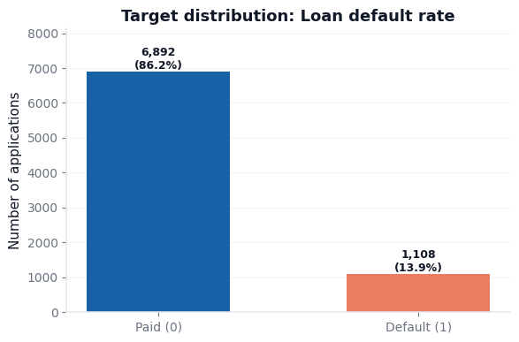
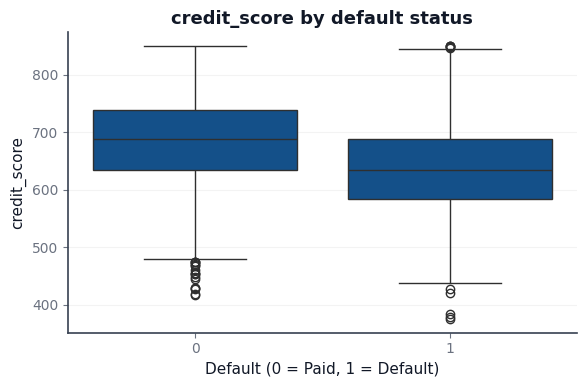
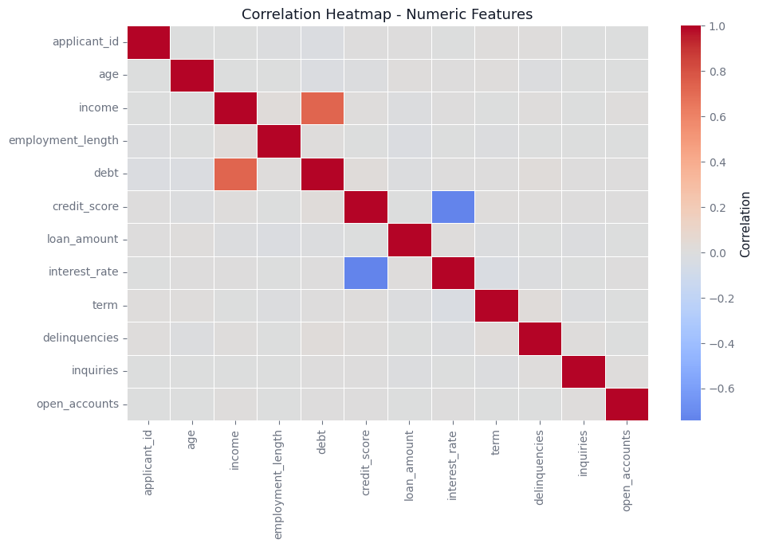

# Credit Risk EDA & Feature Engineering

## Overview
This project performs a complete exploratory data analysis (EDA) on a credit risk dataset with 8,000 loan applications. It identifies key default drivers, engineers EDA-driven features, and produces a model-ready dataset.

## Key Findings
- Class imbalance: ~86% paid vs ~14% default (≈6.2:1)
- Strongest predictors: credit_score (negative), interest_rate (positive)
- Skewed financial variables required log transforms
- No severe multicollinearity detected

## Feature Engineering
15 engineered features including:
- Log transforms for skewed variables
- Debt-to-income ratio
- Missingness indicators
- Interaction terms
- Binned credit score and employment length

## Key Visualizations

### Target Distribution

### Credit Score by Default

### Correlation Heatmap

## Outputs
Processed datasets saved to `/data`:
- X_train_processed.csv, X_test_processed.csv
- y_train.csv, y_test.csv

## Tech Stack
Python, Pandas, NumPy, Matplotlib, Seaborn, Scikit-learn

